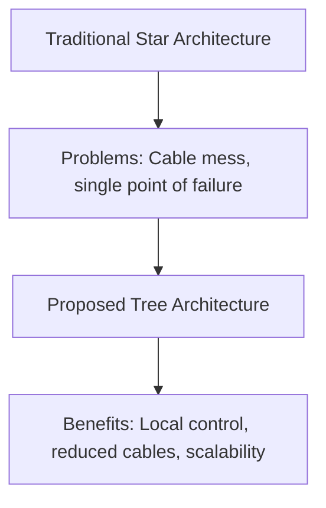
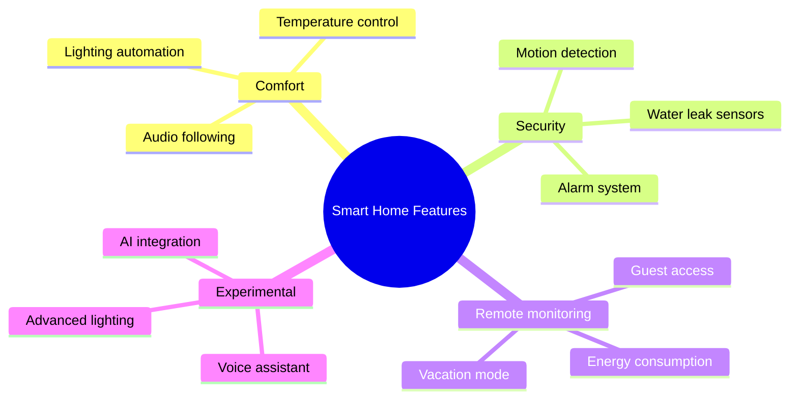
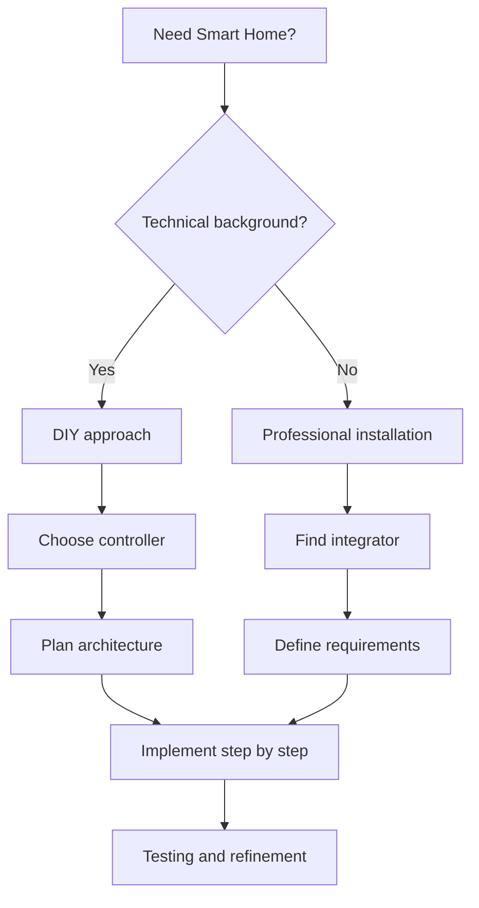
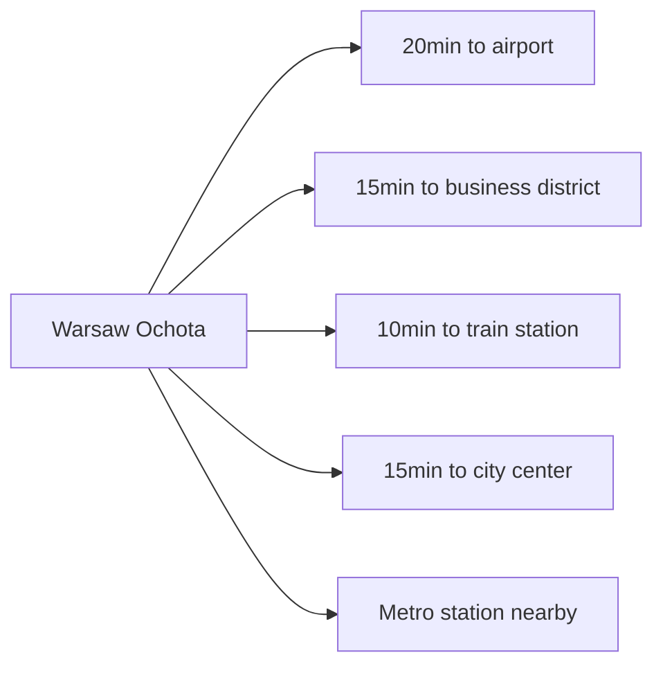
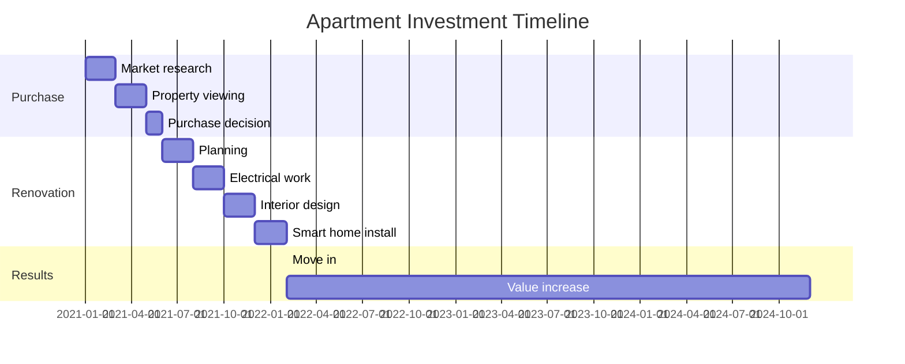

# 💡 Editor Ideas & Development Roadmap - ihome.zentala.io

## 🎯 Core Mission
Tworzyć najwyższej jakości treści o Smart Home i IoT, które pozycjonują Pawła Żentała jako eksperta i pomagają czytelnikom w praktycznych rozwiązaniach.

## 📋 Short-term Goals (Next 30 Days - FOCUS HERE)

### 1. Documentation Completion
**Status**: 🔄 In Progress
**Priority**: HIGH

#### Empty Sections to Fill
- `docs/actuators/` - 11 plików z placeholder content
- `docs/drivers/` - 8 plików z placeholder content
- `docs/sensors/` - 17 plików z placeholder content
- `docs/systems/` - 7 plików z placeholder content

#### Files to Complete First
1. `docs/actuators/elektrozamki.md` - Smart locks documentation
2. `docs/actuators/rolety.md` - Window blinds automation
3. `docs/actuators/termostaty.md` - Smart thermostats
4. `docs/sensors/czujnik-ruchu.md` - Motion sensors
5. `docs/sensors/czujnik-zalania.md` - Water leak sensors

#### Template Structure for Each File
```markdown
---
title: "Nazwa Produktu - Kompletny Przewodnik"
description: "Techniczny opis, zastosowanie, wady i zalety dla instalatorów."
summary: "Krótki opis dla deweloperów i instalatorów."
categories: ['Smart Home']
tags: ['technologia', 'implementacja', 'praktyka']
contributors: ['Paweł Żentała']
---

## Definicja i Zasada Działania
[Techniczny opis działania]

## Zastosowania w Smart Home
[Praktyczne przykłady zastosowań]

## Specyfikacja Techniczna
- Parametry elektryczne
- Protokoły komunikacji
- Kompatybilność

## Instalacja i Konfiguracja
[Krok po kroku]

## Rozwiązywanie Problemów
[Typowe problemy i rozwiązania]

## Koszty i Dostępność
[Analiza rynku]
```

### 2. Internal Linking Strategy
**Status**: 🔄 In Progress
**Priority**: MEDIUM

#### Current State
- Blog articles mention other articles but links are broken
- No systematic cross-referencing
- Documentation lacks navigation between related topics

#### Implementation Plan
1. **Create link mapping** for related content
2. **Update existing articles** with proper internal links
3. **Add "Related Articles" sections** to each piece
4. **Create content clusters** around key topics

#### Example Implementation
In `content/blog/flat/motywacje.md`:
```markdown
Więcej o tym przeczytasz w artykułach:
- [Smart Home w wersji minimum]()
- [Wybór sterownika czy topologii]()
- [Mikrorozdzielnice w praktyce]()
```

### 3. Visual Content Enhancement
**Status**: ⏳ Planned
**Priority**: MEDIUM

#### Current State
- Technical articles lack visual explanations
- Complex concepts like "drzewo architektury" need diagrams
- Installation guides would benefit from photos/diagrams

#### Visual Content Types Needed

##### A. Architecture Diagrams
**Tree Architecture** (from motywacje.md):
```
┌─────────────────────────────────────────┐
│                Central Hub              │
│              (BoneIO/ESP32)             │
└─────────────────┬───────────────────────┘
                  │ MQTT/CoAP
                  ▼
┌─────────────────────────────────────────┐
│              Room Controllers           │
│  ┌─────────────┐ ┌─────────────┐       │
│  │   Salon     │ │  Kuchnia    │  ...  │
│  │ • Światła   │ │ • Czujniki  │       │
│  │ • Rolety    │ │ • Zawory    │       │
│  │ • Czujniki  │ │ • Oświetlenie│      │
│  └─────────────┘ └─────────────┘       │
└─────────────────────────────────────────┘
```

##### B. Installation Diagrams
- Electrical installation layouts
- Network topology diagrams
- Component connection schematics

##### C. Process Flowcharts
- Smart home automation workflows
- Installation step-by-step guides
- Troubleshooting decision trees

#### Tools for Creation
1. **Mermaid.js** - For code-based diagrams in Markdown
2. **Draw.io** - For complex technical diagrams
3. **PlantUML** - For system architecture diagrams
4. **Excalidraw** - For hand-drawn style diagrams

#### Implementation Strategy
1. **Start with simple text-based diagrams** using Mermaid
2. **Create reusable diagram components** for common patterns
3. **Add alt-text and descriptions** for accessibility
4. **Progressive enhancement** - start with ASCII art, enhance later

## 🎨 Visual Content Ideas for Specific Articles

### Article: "Moje motywacje do budowy inteligentnego mieszkania"

#### 1. Architecture Evolution Diagram


#### 2. Smart Home Feature Map


#### 3. Decision Making Flowchart


### Article: "Kryteria zakupu mieszkania"

#### 1. Location Analysis Map


#### 2. Investment Timeline


## 🔗 Content Linking Strategy

### Article Clusters

#### Cluster 1: Smart Home Basics
- `blog/flat/motywacje.md` → Foundation article
- `tutorials/smarthome-minimum/index.md` → Minimum setup
- `tutorials/instalacja-wazniejsza-niz-sterownik.md` → Architecture decisions
- `docs/systems/smart-home.md` → Technical overview

#### Cluster 2: Installation & Setup
- `blog/instalacja/` articles → Personal experiences
- `tutorials/elektryka-pod-smarthome/` → Electrical preparation
- `tutorials/polaczenia-niskonapieciowe/` → Low voltage connections
- `docs/electrical-installation/` → Technical documentation

#### Cluster 3: Components & Devices
- `docs/actuators/` → All actuator types
- `docs/sensors/` → All sensor types
- `docs/drivers/` → Controller options
- `docs/connectors/` → Wiring and connections

### Cross-Reference Examples

#### In Installation Articles
```markdown
Jeśli planujesz instalację elektryczną, przeczytaj najpierw:
- [Elektryka pod Smart Home]()
- [Połączenia niskonapięciowe]()
```

#### In Component Documentation
```markdown
Zastosowanie w praktyce opisane w:
- [Moje doświadczenia z BoneIO]()
- [Instalacja w mieszkaniu]()
```

## 📊 Content Analytics & Measurement

### Current State
- **Google Search Console**: Not set up yet
- **Content performance**: No tracking
- **SEO monitoring**: Manual only

### Setup Recommendations

#### Google Search Console Setup
1. **Verify ownership** of ihome.zentala.io domain
2. **Submit sitemap** at `/sitemap.xml`
3. **Monitor search performance** for Smart Home keywords
4. **Track indexed pages** and search impressions

#### What It Will Give
- **Search traffic insights** - which articles perform best
- **Keyword opportunities** - discover new content ideas
- **Technical issues** - crawl errors, mobile usability
- **CTR optimization** - improve meta descriptions

#### Alternative Analytics
- **Simple Analytics** or **Fathom** for privacy-focused tracking
- **Custom event tracking** for content interactions

## 🚀 Implementation Priority

### Week 1: Foundation
1. **Fix Hugo build issues** - Debug template compatibility
2. **Complete 3-5 key documentation files**
3. **Add basic internal linking to existing articles**
4. **Create 2-3 simple diagrams for complex topics**

### Week 2: Expansion
1. **Complete 5-7 more documentation files**
2. **Enhance internal linking across clusters**
3. **Add visual elements to 3-4 key articles**
4. **Set up basic SEO monitoring**

### Week 3: Optimization
1. **Complete remaining documentation gaps**
2. **Optimize existing content with visuals**
3. **Implement content performance tracking**
4. **Plan next content creation cycle**

## 📝 Personal Notes & Tracking

### Daily Progress Tracking
- **Completed files**: [ ]
- **Visual elements added**: [ ]
- **Internal links created**: [ ]
- **Issues resolved**: [ ]

### Ideas for Future Development
- [ ] AI-powered content suggestions based on user questions
- [ ] Video tutorial series for complex installations
- [ ] Interactive tools (cable calculators, component selectors)
- [ ] Community features (comments, Q&A)
- [ ] Mobile-optimized content for installers

### Technical Debt
- [ ] Hugo template optimization for better performance
- [ ] Image optimization and lazy loading
- [ ] Content caching strategies
- [ ] Multi-language support preparation

---

**Last Updated**: $(date)
**Focus Areas**: Documentation completion, internal linking, visual content
**Next Review**: $(date + 7 days)
