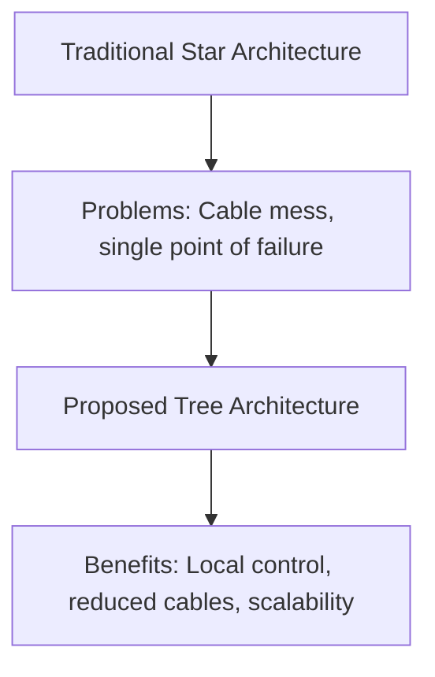

# 📋 Content Development Notes - ihome.zentala.io

## 🎯 Current Focus (October 2025)
TYLKO NA TYM SIĘ KONCENTRUJEMY:

### 1. Documentation Completion - Fill empty docs/ sections
**Priority**: HIGH
**Status**: In Progress

#### Files to Complete (Priority Order):
1. **Actuators** (11 files)
   - `elektrozamki.md` - Smart locks
   - `rolety.md` - Window blinds
   - `termostaty.md` - Smart thermostats
   - `zawory-wody.md` - Water valves
   - `zawory-gazu.md` - Gas valves
   - `wiatraki.md` - Fans
   - `roboty-sprzatajace.md` - Cleaning robots
   - `przekazniki.md` - Relays
   - `sciemniacze.md` - Dimmers

2. **Sensors** (17 files)
   - `czujnik-ruchu.md` - Motion sensors
   - `czujnik-zalania.md` - Water leak sensors
   - `czujnik-temperatury.md` - Temperature sensors
   - `czujnik-wilgotnosci.md` - Humidity sensors
   - `czujnik-swiatla.md` - Light sensors
   - `czujnik-gazu.md` - Gas sensors
   - `czujnik-dymu.md` - Smoke sensors
   - `czujnik-cisnienia.md` - Pressure sensors

3. **Systems** (7 files)
   - `smart-home.md` - Overview
   - `automatykabudynkowa.md` - Building automation
   - `system-alarmowy.md` - Alarm systems
   - `naglosnienie-strefowe.md` - Zone audio
   - `rtls.md` - Location tracking
   - `ups.md` - Backup power

#### Template for Each File:
```markdown
---
title: "Nazwa Produktu - Kompletny Przewodnik"
description: "Techniczny opis, zastosowanie, wady i zalety dla instalatorów."
summary: "Krótki opis dla deweloperów i instalatorów."
categories: ['Smart Home']
tags: ['technologia', 'implementacja', 'praktyka']
contributors: ['Paweł Żentała']
---

## Definicja i Zasada Działania
[Techniczny opis działania]

## Zastosowania w Smart Home
[Praktyczne przykłady zastosowań]

## Specyfikacja Techniczna
- Parametry elektryczne
- Protokoły komunikacji
- Kompatybilność

## Instalacja i Konfiguracja
[Krok po kroku]

## Rozwiązywanie Problemów
[Typowe problemy i rozwiązania]

## Koszty i Dostępność
[Analiza rynku]
```

### 2. Internal Linking - Connect related articles
**Priority**: MEDIUM
**Status**: In Progress

#### Current Issues:
- Blog articles mention other articles but links are broken
- No systematic cross-referencing
- Documentation lacks navigation between related topics

#### Implementation Strategy:
1. **Create link mapping** for related content
2. **Update existing articles** with proper internal links
3. **Add "Related Articles" sections** to each piece
4. **Create content clusters** around key topics

#### Example Implementation:
In `content/blog/flat/motywacje.md`:
```markdown
Więcej o tym przeczytasz w artykułach:
- [Smart Home w wersji minimum]()
- [Wybór sterownika czy topologii]()
- [Mikrorozdzielnice w praktyce]()
```

### 3. Visual Content - Add diagrams and photos
**Priority**: MEDIUM
**Status**: Planned

#### Visual Content Types Needed:

##### A. Architecture Diagrams
**Tree Architecture** (from motywacje.md):


##### B. Installation Diagrams
- Electrical installation layouts
- Network topology diagrams
- Component connection schematics

##### C. Process Flowcharts
- Smart home automation workflows
- Installation step-by-step guides
- Troubleshooting decision trees

#### Tools for Creation:
1. **Mermaid.js** - For code-based diagrams in Markdown
2. **Draw.io** - For complex technical diagrams
3. **PlantUML** - For system architecture diagrams
4. **Excalidraw** - For hand-drawn style diagrams

## 📊 Progress Tracking

### Daily Checklist
- [ ] Complete 1-2 documentation files
- [ ] Add 3-5 internal links to existing articles
- [ ] Create 1 visual diagram for complex topic
- [ ] Test Hugo build after changes

### Completed Today
- [x] Started documentation completion
- [x] Fixed contributors format issues (41 files)
- [x] Created ideas documentation in .cursor/rules/editor/ideas.md
- [x] Set up development tracking with .cursor/todo/content-development-notes.md
- [x] Added visual diagrams to articles (architecture tree vs star, Smart Home roadmap)
- [x] Created automation scripts for metadata optimization

## 🔧 Technical Notes

### Hugo Build Issues
- **Status**: Template compatibility problems
- **Root cause**: Contributors field format
- **Solution**: Fixed format, still testing

### Content Structure
- **Blog articles**: Personal experiences and guides
- **Documentation**: Technical specifications
- **Tutorials**: Step-by-step instructions
- **Services**: Paweł's offerings

### File Naming Conventions
- Use kebab-case for file names
- Follow existing patterns
- Include index.md for directories

## 📈 Success Metrics

### Content Quality
- **Documentation completion**: X/35 files completed
- **Internal linking**: Y links added
- **Visual content**: Z diagrams/photos added

### Technical Health
- **Hugo builds**: Passing/failing
- **SEO optimization**: Meta descriptions complete
- **Performance**: Load times acceptable

## 🚨 Blockers & Issues

### Current Blockers
- [ ] Hugo build still failing - need to debug template issues
- [ ] Visual content creation tools not set up
- [ ] Some placeholder content needs research

### Risk Mitigation
- [ ] Test changes in small batches
- [ ] Keep backups of working content
- [ ] Document all changes for rollback

## 💡 Ideas for Future

### Content Expansion
- [ ] Video tutorials for complex installations
- [ ] Interactive tools (calculators, configurators)
- [ ] Case studies from Paweł's projects
- [ ] Community Q&A section

### Technical Enhancements
- [ ] Better image optimization
- [ ] Content search functionality
- [ ] Mobile-responsive diagrams
- [ ] Dark mode support

---

**Focus Reminder**: Documentation completion + Internal linking + Visual content
**Next Review**: Daily progress check
**Goal**: Complete foundation for professional Smart Home knowledge base
