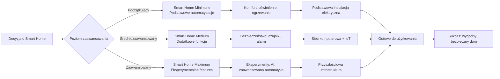

---
categories:
- Smart Home
- Mieszkanie
contributors: ['Paweł Żentała']
date: 2022-06-23 23:01:03+01:00
description: 'Jak to się zaczęło? Czemu tutaj i czemu inwestować w takie mieszkanie? '
draft: false
homepage: false
lastmod: 2022-06-23 23:01:03+01:00
pinned: false
seo:
  canonical: ''
  description: Moje motywacje do budowy inteligentnego mieszkania - kompleksowy opis
    Więcej informacji na smart home znajdziesz w naszym serwisie.
  noindex: false
  title: Moje motywacje do budowy inteligentnego mieszkania | Dokumentacja - ihome.zentala.io
summary: Jak to się zaczęło? Po co i dlaczego zdecydowałem się zainwestować w mieszkanie
  IoT? Czy to dla każdego? Dla kogo nie? A może w ograniczonym zakresie? Jakim? Czego
  bym dziś nie robił, a co uważam za niezbędne.
tags: []
thumb: https://static.zentala.io/flat/iot-planning.jpg
title: Moje motywacje do budowy inteligentnego mieszkania
weight: 50
---

Planując remont mieszkania zdecydowałem się polecieć grubo i wykończyć je luksusowo i inteligentnie.

Luksusowo ponieważ lubię piękne wnętrza, byłem grafikiem, pasjonuje mnie design i chciałem dać popis swoją wizją i umiejętnościami, co mam nadzieję mi się uda. A poza tym w razie potrzeby będę w stanie je dobrze sprzedać. Biorąc pod uwagę dzielnicę (Warszawska Stara Ochota), jest to dobre miejsce aby zainwestować w ładną aranżację wnętrza - sporo potencjalnych klientów może szukać takiej nieruchomości w tej okolicy.

Natomiast inteligentnie... no właśnie... dlaczego?

## Podstawowe automatyzacje dla komfortu i bezpieczeństwa
Opisałem je w artykule [smart home w wersji minimum](), ale podsumujmy je po krótce:
* komfort
  * gdy wchodzisz do mieszkania z siatką zakupów, chcesz mieć automatycznie zapalone światło na korytarzu i w kuchni
  * chcesz też mieć automatyczne światło w łazience jako że korzystasz z niej bardzo często
  * chcesz mieć automatycznie wyłączane światła w tych pomieszczeniach celem redukcji zużycia energii elektrycznej
* bezpieczeństwo
  * czujniki zalania w kuchni i łazience połączone z zaworami odcinającymi wodę
  * czujniki ognia i dymu, gazu, celem zabezpieczenia kuchni przed pożarem lub wybuchem

To są takie najbardziej podstawowe automatyzacje które rekomendowałbym każdemu kto remontuje mieszkanie dla siebie lub dla innych.

## Ważne dla mnie automatyzacje

Miałem ich kilka:
* **scena "zasypiam natychmiast"** - wyłączyć światło w całym domu i zamknąć drzwi wejściowe z jednego przycisku obok łóżka :joy:
* **robię sobie śniadanie w kuchni i słucham calla w pracy** - gdy pracuję na zdalnym i słucham długich rozmów online, to te podążają za mną po mieszkaniu dzięki czemu mogę efektywniej wykorzystać ten czas
* **jedno kliknięcie na wyciągnięcie ręki aby zmienić scenę oświetleniową**:
  * (w sypialni) zmienić nastrój
  * (w pracowni) doświetlić pokój wchodząc na call z kamerką
* **scena "jadę na wakacje"** - zakręć wodę, sprawdź czy okna są zamknięte, uzbrój system alarmowy, przekieruj połączenia z domofonu oraz dzwonki do drzwi do aplikacji VoIP na moim telefonie

## Zdalny nadzór
Lubię spędzać zimy w ciepłych krajach. Chciałem mieć w tym czasie nadzór i kontrolę nad swoim mieszkaniem, tj.:

* Wzmocnić bezpieczeństwo przed włamywaczami dzięki systemowi alarmowemu opartemu na czujnikach ruchu i otwarcia. Symulować obecność gdy jestem poza domem.
* Zabezpieczyć się przed zalaniem dzięki czujnikom zalania i automatycznym zaworom. W razie potrzeby wezwać dozorcę lub hydraulika.
* Odbierać informacje o stanie licznika prądu przez internet aby móc dzielić się odczytami z dostawcą energii elektrycznej przez internet.
* Móc otwierać drzwi zdalnie dla gości którym zdecyduję się udostępnić mieszkanie na czas swojej nieobecności. Pozwolić zostawić w środku paczkę kurierowi gdy mnie nie ma w mieszkaniu - odebrać domofon, otworzyć drzwi klatkowe, wreszcie otworzyć drzwi do mieszkania i mieć na kamerze pogląd na tego kuriera.

## Wzrost wartosci mieszkania

Ponieważ zdecydowałem się na wymianę instalacji elektrycznej, co pociąga za sobą kucie ścian, uznałem, że dodam SH ponieważ zwiększy wartość mieszkania dzięki odczuwalnemu zwiększeniu komfortu.

## Portfolio

Jako programista z doświadczeniem w IoT zdecydowałem się zamienić swoje mieszkanie w inteligentny apartment...

Programiści mają swoje portfolio - zwykle kilka publicznych pokazowych repozytoriów kodu projektów aplikacji na GitHubie, które pozwalają pracodawcom wstępnie ocenić poziom ich kompetencji.

Ja mam nieco inne podejście do budowy portfolio. Zauważyłem ze nikt nie ocenia kodu tego portfolio. Jeśli już to sprawdzaja ilosc gwiazdek aby ocenic czy zbudowalem cos liczacego sie open source.

Natomiast wszyscy oceniają to co można latwo ocenic - tak jak te gwiazki - efekty. Oceniaja moj prototyp robota, ze pracowałem w hongkongu, oceniają inteligente buyrk z regulacja wysokosci. Chca zonbaczyc przed oczami prosty obraz. Tak dziala wizerunek, tak dziala ludzki mozg. Pokaz obraz a ludzie zobaczac historie. Pokaz 1000 gwiazdek - pomysla ze jestes dobry, chociaz moze tak na prawede wymysliles po postu dobry pomysl a nie kod. Pokaz smart home - pomysla ze jestes utalentowany, chociaz to wcale nie znaczy ze musiszisz umiec swietnie kodowac.

Dlatego robie do portofolio konkretne projety ktore latwo można sobie wyobrazic, a jednoczesnie ktore pobudzaja wyobraznie i fanazje. Takim projektem bez watpienia jest smart home.

## Pokaz moich umiejętności komunikacyjnych
Jako programista jestem "skazany" na programowanie, bo za to najlepiej w PL płacą. Ale nie czuję aby to był max moich talentów. Uważam że jestem też dobry w komunikacji, od lat interesuję się interfejsami człowiek-komputer, mam doświadczenie designerskie. Chciałem się wykazać i połączyć te doświadczenia. Projektowanie komunikacji inteligentnego domu to czysta karta, nadal otwarty rynek. Chcę zbudować demo swojej wizji.

Zakładam że kilka prostych funkcjonalności może dać dobry efekt:
- po wejściu do domu,
  - jakiś prosty sygnał dźwiękowy sygnalizujący przebudzenie się asystenta, wykryciu ruchu
  - animacja światła, jakby migające świetlówki, ale zrobiona na LEDach
  - może asystent nas przywita głosem i będzie dało się z nim porozmawiać
  - animacja świateł będzie skoordynowana z asystentem, jedno czy dwa mrugnięcia będą coś znaczyły, efekt ma być taki jakby np. zadanie pytania wywoływało przeciążenia obwodu
  - to wszystko łącznie ma dać poczucie że jest się w inteligentnym, żywym świadomym mieszkaniu, ale z pewnymi niedoskonałościami, jak każdy człowiek

czyli de facto poza sprawdzonymi rozwiązaniami buduję przestrzeń do eksperymentów, których nie poleciłbym swoim klientom (ale hobbyści są zapraszani do zabawy); oto one.

## Eksperymentalne features
Rozwiązania z którymi eksperymentuję, ale nie są gotowe do implementacji

* wykorzystanie microphone arrays do rozmowy z asystentem głosowym
* własny serwer z LLM, asystentem głosowym i rozpoznaniem mowy do trzymania asystenta wewnątrz domu
* własna mikro-serwerownia - mało przykładów jak ją zrobić, eksperymentuję, chociaż pomysł wydaje się warty rozwagi to mam wątpliwości np. co do chłodzenia jej
* zaawansowane sterowanie ledami, sceny i animacje świetlne
  * wady: nie ma dobrych uniwersalnych rozwiązań do tego
  * czytaj więcej: artykuł w którym opisuję [dostępne narzędzie do grania światłem]()
* czujniki obecności w ścianach - za lustrami, w ciągach telecom
  * wady: nie wiem czy w ogóle będą dobrze działały i jaką dobrać elektronikę
* BLE RTLS w mieszkaniu - nieustanna detekcja obecności przez lokalizację
  * wady: cena, trudność w konfiguracji, kto będzie nosił tag albo smartwatch 24/h?
  * czytaj więcej: [WIP: indoor-GPS for constant presence tracking]
* wewnętrzne rolety w oknach
  * wady: praktycznie nie ma takich na rynku, czekam aż się pojawią
  * komentarz: warto rozważyć zostawienie zasilania w puszkach jak to zrobiłem jeśli bardzo Ci na nich zależy
* dedykowane przełączniki zwierne ze scenami
  * wady: drogie, mały wybór, nie da się skomponować z ramkami
  * opinia: tak na prawdę to raczej [pomysł na startup]() niż rozwiązanie

Wszystkie te pomysły mimo że uważam za dobre i z potencjałem to są w bardziej lub mniej wstępnej fazie rozwoju. Nie uznałbym ich za stabilne. To są rzeczy z jakimi mogą się bawić elektronicy i programiści, ale w które nie warto inwestować czasu i pieniędzy jeśli nie traktujesz smart home jako hobby i pasji.

## Konkluzja

Tak więc moje motywacje nie są do końca typowe. Piszę o tym ponieważ zanim zaczniesz kopiować wszystko jak leci z moich pomysłów, weź pod uwagę że one nie są dla każdego. Buduję mieszkanie do eksperymentów i próbuję zrealizować w nim jakąś nietypową wizję. To niekoniecznie jest rozwiązanie dla Ciebie, chyba że masz podobną wizję.

## To co konkretnie mi jednak polecasz?

Jednocześnie staram się wyznaczyć standard dla inteligentnych domów. Starałem się zoptymalizować podejście do projektowania i wiele rzeczy jest do skopiowania. Więcej o tym co na pewno bym zachwalał znajdziesz w artykule [smart home w minimalnej wersji]() - opisuję tutaj minimalną infrastrukturę którą rekomendowałbym każdemu remontującemu mieszkanie. Zaś w artykule [smart home w wersji medium]() opisuję co nie jest aż tak niezbędne ale warto dodać do wersji basic. Z kolei w artykule [wybór sterownika czy topologii infrastruktury]() opisuję jakie przewody bym dodatkowo dodał w całym mieszkaniu aby mieć instalację future proof, jeśli w przyszłości pojawią się fajne możliwości rozszerzania instalacji. Dodatkowo polecam zapoznać się z koncepcją [mikrorozdzielnic](), która pozwala ograniczyć ilość kabli w tak złożonym systemie.

#### Mapa Drogi do Smart Home

